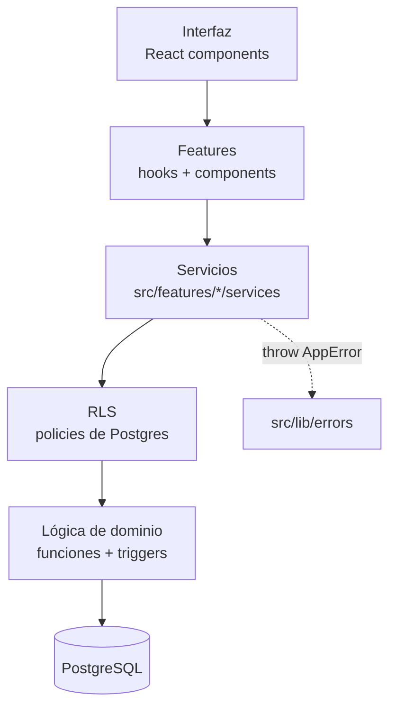
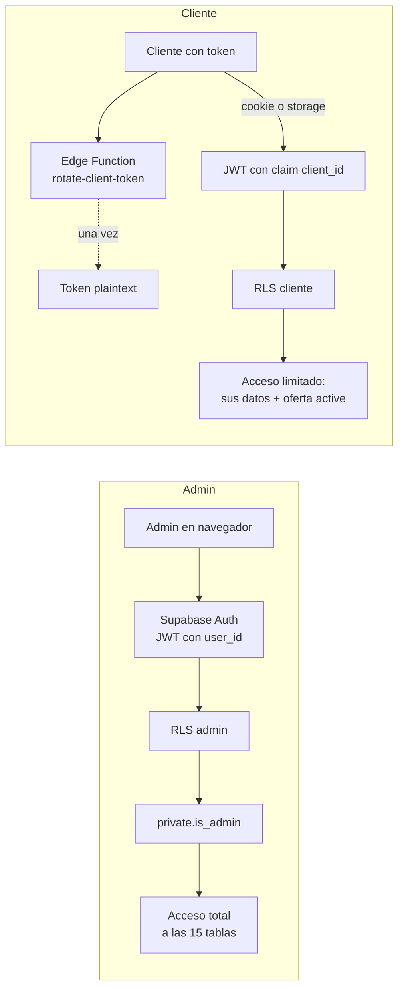
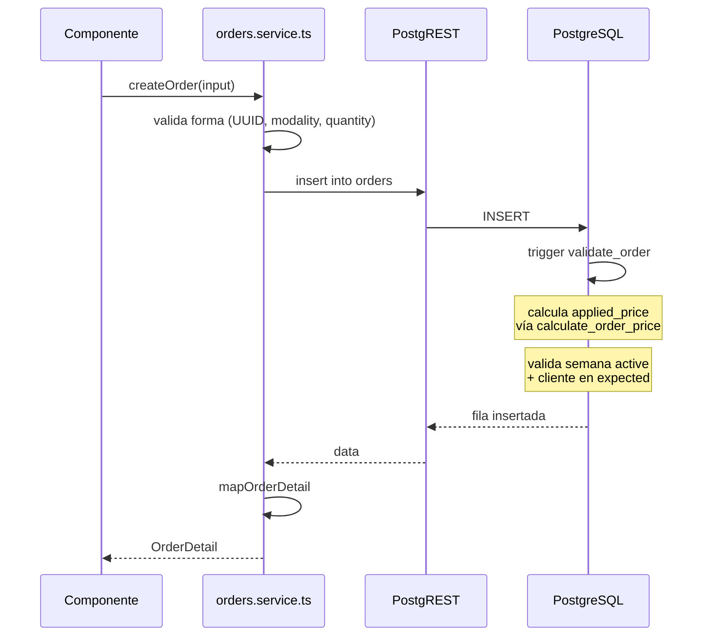
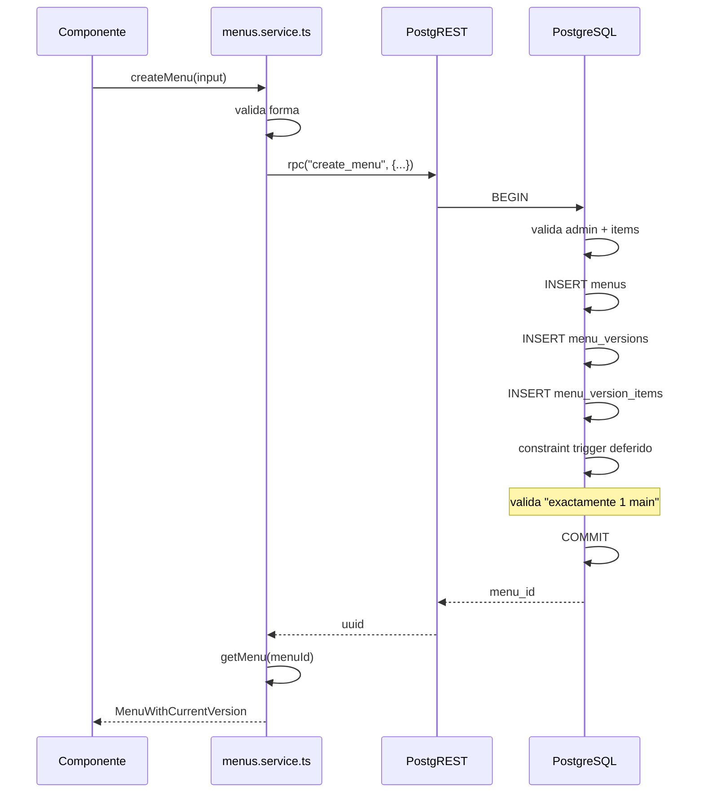
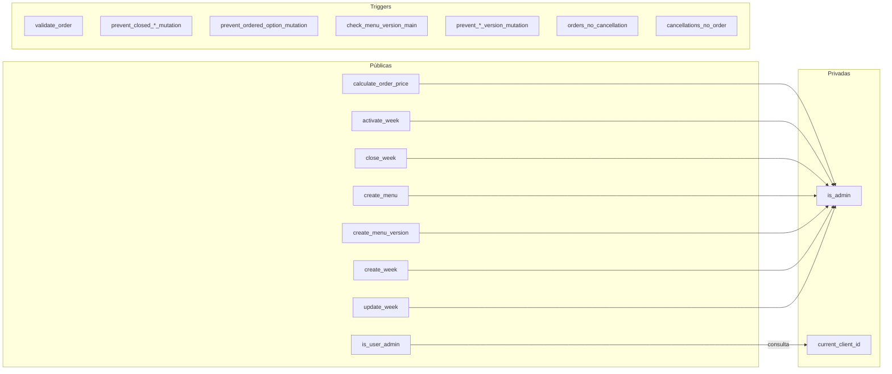
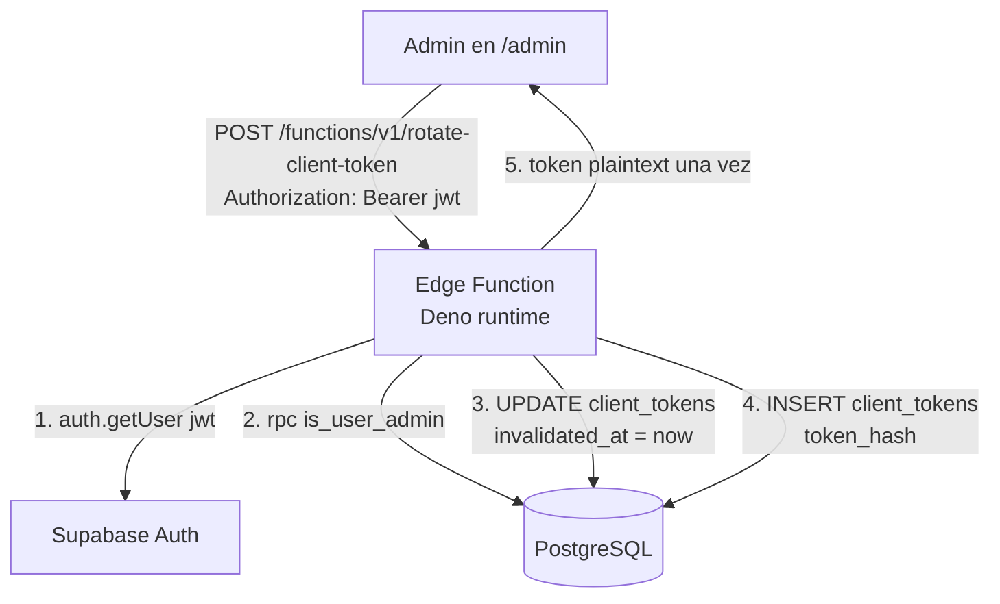
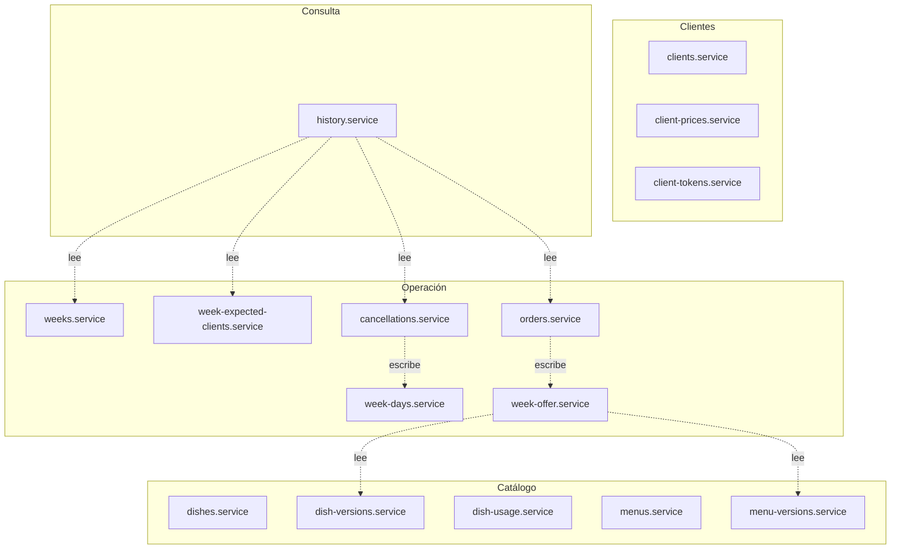

# Arquitectura

## Capas



**Reglas:**

- La UI no conoce Supabase. Solo consume servicios.
- Los servicios encapsulan todas las llamadas a Supabase.
- RLS decide qué filas son visibles y modificables según quién consulta.
- Las funciones de dominio (precio, activación de semana, creación atómica de menús y semanas) viven en PostgreSQL, no en TypeScript.
- Los errores se propagan como `AppError` desde la capa de servicio.

## Separación de responsabilidades

```
¿Dónde va esta lógica?

Regla de negocio crítica
    → PostgreSQL (constraint, función, trigger)

Acceso a datos + validación de forma
    → Service (src/features/*/services)

Estado de UI (loading, saving, error, empty)
    → Hook / componente

Presentación
    → Componente
```

## Los dos consumidores



Ambos llegan a las mismas tablas. La diferencia es:

- **Admin:** se autentica con Supabase Auth normal. Sus `auth.uid()` aparece en `private.admin_users`. Las policies le dan `FOR ALL`.
- **Cliente:** no tiene cuenta. La Edge Function (u otro canal) le emite un JWT con claim `client_id`. Las policies chequean `private.current_client_id()` para limitar todo a sus propias filas.

Nota: la emisión del JWT del cliente (para acceder a `/menu/:token`) todavía no está implementada. Ver "Pendientes" abajo.

## Flujo de una petición de escritura

Ejemplo: admin crea un pedido.



**Puntos clave:**

- El `applied_price` **no lo envía el frontend**. El trigger lo calcula.
- La validación de negocio (semana activa, cliente esperado, etc.) es del trigger, no del servicio.
- El servicio solo valida **forma** (UUID válido, enumeraciones, tipos).

## Flujo de una operación atómica multi-tabla

Ejemplo: admin crea un menú con composición.

Sin RPC, la creación de un menú requeriría:

1. INSERT en `menus`.
2. INSERT en `menu_versions`.
3. INSERT en `menu_version_items`.

Si el paso 3 falla, la versión queda huérfana e inmutable (trigger inmutable + FK sin cascade). **No hay rollback posible desde el frontend.**

Por eso se usa un RPC:



**RPCs atómicos en el proyecto:**

| RPC | Qué crea |
|---|---|
| `create_menu` | menus + menu_versions + menu_version_items |
| `create_menu_version` | menu_versions + menu_version_items |
| `create_week` | weeks + 5 week_days |
| `update_week` | recrea week_days (con cascade sobre week_day_options) |

## Funciones de dominio en PostgreSQL



**Públicas:** invocables desde el frontend (admin) o desde la Edge Function.
**Privadas:** solo invocables por RLS policies o por otras funciones.
**Triggers:** corren automáticamente en INSERT/UPDATE/DELETE.

## Edge Function



**Seguridad:**

- Requiere JWT de admin.
- Verifica admin contra `private.admin_users` vía RPC público.
- Usa `service_role` internamente para escribir en `client_tokens` (que no tiene policy de cliente).
- Devuelve el token en texto plano **una única vez**. Nunca se persiste en frontend.

## Diagrama de features



## Pendientes de arquitectura

- **Emisión de JWT de cliente:** falta el endpoint que valida el token personal del cliente y emite un JWT con claim `client_id`. Sin esto, `/menu/:token` no puede operar contra Supabase con las policies actuales.
- **Realtime:** Supabase Realtime no está configurado. Cuando se agregue la UI, definir qué tablas se suscriben.
- **Vistas o RPC de reportes:** varios servicios calculan agregados en cliente (dish-usage, order totals, historical weeks). Migrar a vistas o RPC si el volumen crece.