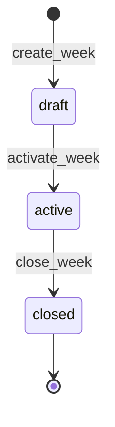

# Dominio

Resumen operativo del dominio de Todo Artesanal.

**Fuente de verdad:** `docs/prompt.md` (contrato completo). Este documento
es una síntesis de trabajo, sin las decisiones de implementación.

## Separación fundamental

El dominio se divide en cuatro conceptos que **nunca deben mezclarse**:

```
Oferta / Semana  = qué se ofrece

Cliente          = qué tiene configurado actualmente

Pedido           = qué eligió realmente

Historial        = qué ocurrió y bajo qué contexto
```

**Regla maestra:** una modificación posterior de la configuración actual
nunca debe alterar retrospectivamente el significado de un hecho
histórico.

## Oferta / Semana

Representa **qué se ofrece** durante un período operativo (típicamente
lunes a viernes).

- Es común a todos los clientes. No existe "la semana de Juan".
- Los 5 días laborales son parte de la semana, no una entidad separada.
- Cada día contiene opciones de oferta disponibles.

### Ciclo de vida



| Estado | Significado |
|---|---|
| `draft` | En configuración. No es oferta operativa. |
| `active` | Oferta disponible. Los clientes pueden pedir. Solo una a la vez. |
| `closed` | Período terminado. Históricamente inmutable. Terminal. |

### Población esperada

Al activar una semana se congela la lista de clientes que debían
responder (`week_expected_clients`). A partir de ahí:

- Cambios posteriores en `clients.active` **no afectan** esa semana.
- El cálculo de "sin responder" se hace contra esta lista, no contra el
  estado actual del cliente.

## Cliente

Representa la **configuración actual** de una persona.

- Datos: nombre, teléfono, dirección.
- Configuración: cuidado especial, observaciones, `active`, `allows_half_portion`.
- Precios especiales: general, opcional, o por plato específico.
- Acceso: un token personal para entrar al menú.

**El cliente NO cambia el historial.** Desactivarlo hoy no elimina ni
altera pedidos de semanas pasadas.

## Pedido

Representa **qué eligió** un cliente para un día concreto de una semana.

Componentes:

```
cliente + semana + día + opción de oferta + modalidad + cantidad + precio aplicado
```

- La opción de oferta puede ser un plato o un menú.
- La modalidad es `general`, `opcional` o `media_vianda`.
- `applied_price` es unitario y **queda congelado** al crear el pedido.
- `quantity` es la cantidad de unidades.

### Restricciones

- Un cliente no puede tener dos pedidos idénticos (mismo cliente +
  opción + modalidad). Para más cantidad: `quantity`.
- Un cliente no puede tener pedido y cancelación el mismo día.
- Los pedidos de una semana `closed` no se modifican ni se borran.

## Cancelación

Representa un hecho operativo: el cliente **no va a recibir vianda** un
día concreto.

- Afecta al día completo (no a una modalidad específica).
- Cuenta como **respuesta** para el cálculo de "sin responder".
- Es un hecho histórico inmutable: se crea o se elimina. No se edita.

## Historial

Hechos consolidados del pasado. Deben reconstruir lo que ocurrió aunque
la configuración actual sea distinta.

### Referencia vs Snapshot

Para cada dato histórico:

- **Referencia:** el dato se consulta por relación (ej: `dish_version_id`
  apunta a una versión inmutable).
- **Snapshot:** el valor se congela en el hecho (ej: `orders.applied_price`).
- **Inmutable:** no puede modificarse (ej: `dish_versions`).

**Pregunta que gobierna la decisión:** ¿qué necesitamos conservar para
reconstruir correctamente qué ocurrió en ese momento aunque mañana
cambien los datos actuales?

### Ejemplos resueltos

| Hecho | Cómo se preserva |
|---|---|
| Precio aplicado a un pedido | Snapshot en `orders.applied_price`. |
| Contenido de un plato en una semana histórica | Referencia a `dish_versions` inmutable. |
| Población esperada de una semana | Snapshot en `week_expected_clients`. |
| Nombre de un plato al momento del pedido | Referencia a `dish_versions.name` (inmutable). |

## Catálogo

### Plato

Unidad individual del catálogo: Milanesa, Puré, Empanadas.

Atributos de clasificación (no versionados):

- `category` (texto libre).
- `climate` (`frio` / `templado` / `calor` / null).
- `active`.

### Menú

Combinación de platos: un plato principal + 0..N guarniciones.

- "Arroz con pollo" es un menú válido sin guarniciones.
- "Guisito + Fideos + Vegetales" también es válido.
- No se asume exactamente una guarnición.

### Versiones

Platos y menús tienen **identidad lógica** (`dishes` / `menus`) y
**versiones inmutables** (`dish_versions` / `menu_versions`).

- Cada edición de nombre o precio crea una versión nueva.
- Las versiones anteriores nunca se modifican (trigger).
- El historial apunta siempre a versiones concretas, no a la identidad.

**Consecuencia:** editar un plato hoy no cambia lo que se ofreció en
semanas pasadas.

## Modalidades de pedido

Exclusivamente tres:

| Modalidad | Significado |
|---|---|
| `general` | Vianda completa. Modalidad normal. |
| `opcional` | Vianda completa con precio especial propio. |
| `media_vianda` | 50% de una vianda completa. |

### Media vianda

- Es una **modalidad**, no un tipo de plato ni una categoría de producto.
- Puede basarse en un plato individual, un menú, empanadas, etc.
- Se calcula como `precio normal / 2`, usando la rama `general`.
- No tiene precio especial propio.
- Requiere `clients.allows_half_portion = true`.

## Precios

### Tipos

| Precio | Dónde vive | Cambia cuándo |
|---|---|---|
| Base | `dish_versions.price` / `menu_versions.price` | Nueva versión. |
| Especial general | `client_prices[modality='general']` | Edición de config del cliente. |
| Especial opcional | `client_prices[modality='opcional']` | Idem. |
| Especial por plato | `client_product_prices[dish_id]` | Idem. |
| Aplicado | `orders.applied_price` | **Nunca**. Congelado al crear. |

### Precedencia

Para **dish**:

```
precio específico por plato
    ↓ si no existe
precio especial general (o opcional, según modalidad)
    ↓ si no existe
precio base de la versión del plato
```

Para **menu**:

```
precio especial general (o opcional)
    ↓ si no existe
precio base de la versión del menú
```

Los precios específicos por plato **no aplican** a menús.

### Media vianda

`precio normal aplicable / 2`, donde "normal" usa la rama general.

### Congelamiento

`applied_price` queda inmutable al crear el pedido. Cambios posteriores
en precios base o especiales **no lo modifican**.

## Tokens de acceso

Cada cliente accede a su menú personal (`/menu/:token`) sin cuenta de
usuario.

- El token se almacena **hasheado** (SHA-256). Nunca en texto plano.
- Al rotar, el token anterior queda **inmediatamente inválido**.
- Como máximo un token vigente por cliente.
- El historial de tokens se conserva (para auditoría).

## Seguridad

- **Frontera real:** RLS + restricciones + funciones de PostgreSQL.
- **Frontend:** no es frontera de seguridad.
- **Cliente:** solo puede acceder a sus propios datos + oferta activa.
- **Admin:** acceso completo, identificado por `private.admin_users`.

## Invariantes del sistema

Las 11 originales de `prompt.md` §36:

1. `media_vianda` no es un tipo de plato.
2. Un menú puede tener 0, 1 o N guarniciones.
3. Un pedido histórico conserva su precio aplicado.
4. Modificar precios actuales no cambia pedidos anteriores.
5. Desactivar un cliente no elimina su historial.
6. Una semana no pertenece a un cliente.
7. Rotar un token invalida el anterior.
8. Un cliente no puede consultar pedidos de otro.
9. Una semana histórica no depende del estado actual del cliente.
10. El cálculo de precio no está duplicado.
11. Las operaciones no permitidas para una semana cerrada no pueden
    ejecutarse manipulando el frontend.

Extendidas en Fase 4:

12. Las cancelaciones conservan su contexto histórico.
13. "Sin responder" se determina respecto de la semana correspondiente.
14. La oferta semanal es común; las diferencias individuales pertenecen
    a configuración/pedido del cliente.
15. Los hechos históricos no se reinterpretan mediante datos actuales.

## Glosario rápido

Ver `docs/glosario.md` para definiciones extendidas de:

- Semana, oferta, opción de oferta.
- Cliente, cliente esperado.
- Pedido, cancelación, sin responder.
- Plato, menú, versión, uso histórico.
- General, opcional, media vianda.
- Precio base, especial, aplicado.
- Token personal, rotación.