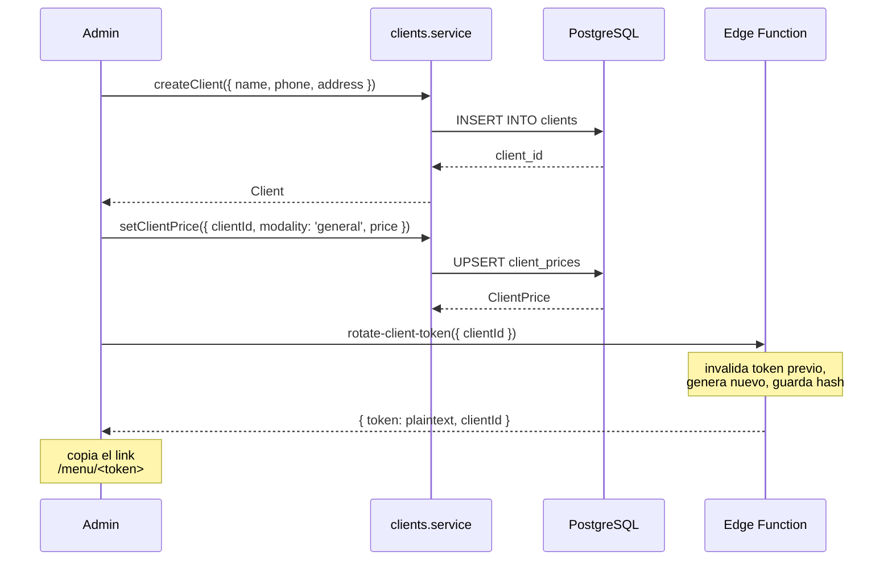
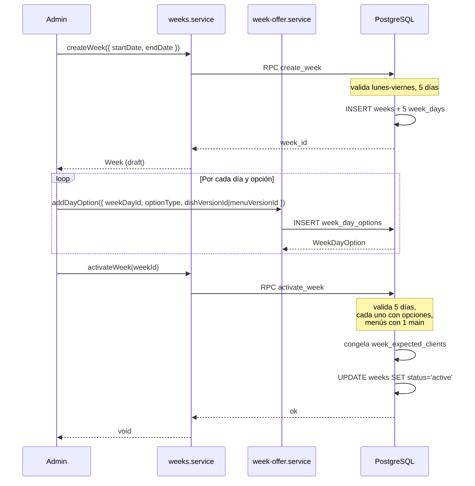
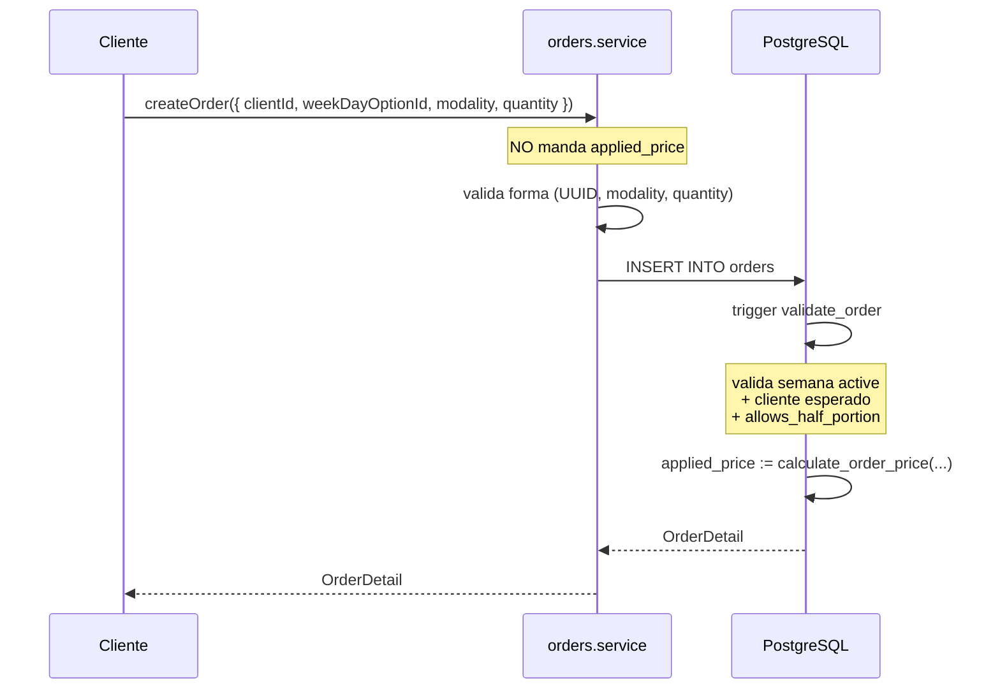
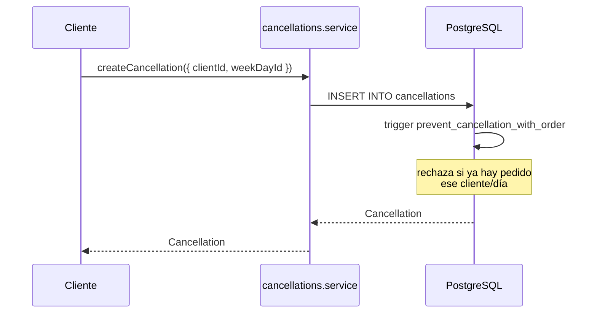
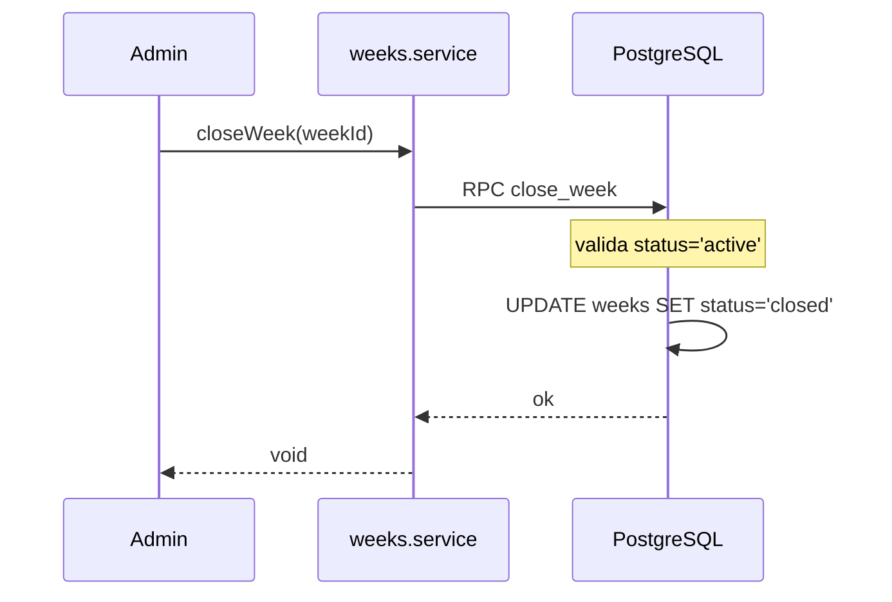
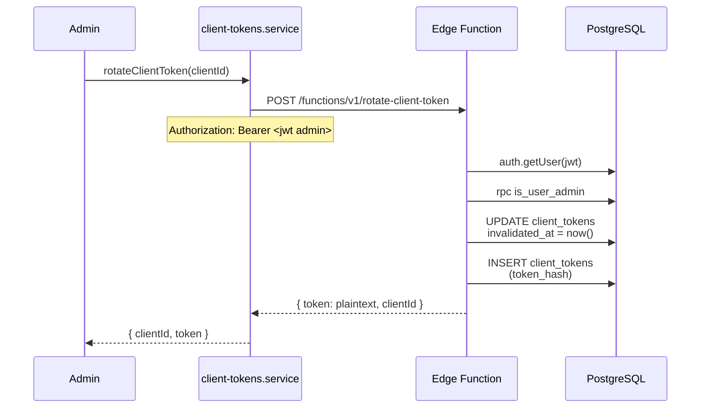
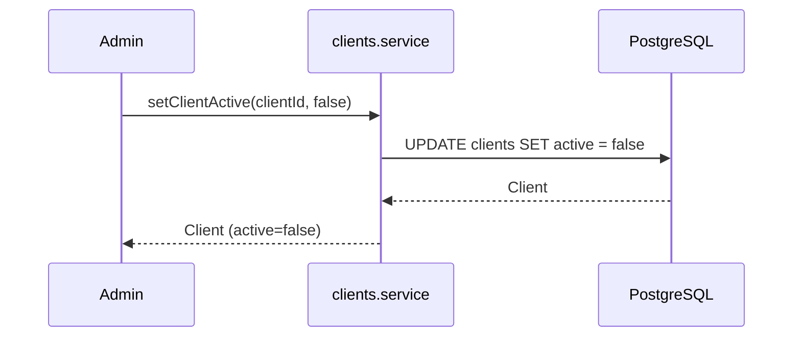
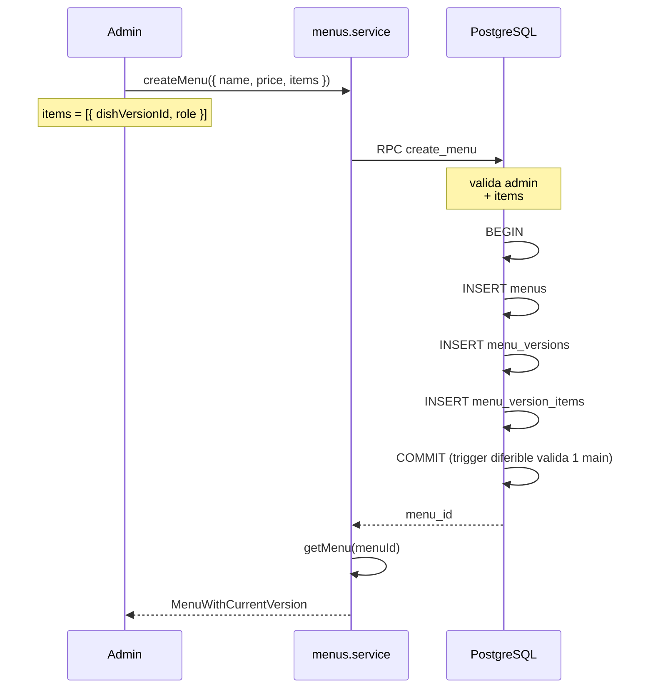

# Flujos operativos

Secuencia de las operaciones típicas de Todo Artesanal.

Cada flujo indica: quién actúa, qué servicios se invocan, qué reglas
de negocio se aplican, y qué invariantes están en juego.

## Índice

1. [Onboarding de un cliente](#1-onboarding-de-un-cliente)
2. [Crear y activar una semana](#2-crear-y-activar-una-semana)
3. [Cliente pide una vianda](#3-cliente-pide-una-vianda)
4. [Cliente pide media vianda](#4-cliente-pide-media-vianda)
5. [Cliente cancela un día](#5-cliente-cancela-un-día)
6. [Admin cierra la semana](#6-admin-cierra-la-semana)
7. [Ver quién no respondió](#7-ver-quién-no-respondió)
8. [Rotar el token de un cliente](#8-rotar-el-token-de-un-cliente)
9. [Dar de baja a un cliente](#9-dar-de-baja-a-un-cliente)
10. [Crear un plato con su primera versión](#10-crear-un-plato-con-su-primera-versión)
11. [Crear un menú compuesto](#11-crear-un-menú-compuesto)
12. [Modificar el precio de un plato](#12-modificar-el-precio-de-un-plato)

---

## 1. Onboarding de un cliente

**Actor:** admin.

**Objetivo:** dar de alta un cliente y generarle su link personal.



**Pasos:**

1. Crear el cliente con `createClient`.
2. Opcional: cargar precios especiales con `setClientPrice` y/o
   `setClientProductPrice`.
3. Generar el link personal con `rotateClientToken`. **El token
   plaintext se muestra una única vez**. El admin lo copia y lo manda
   al cliente (WhatsApp, email, etc.).

**Invariantes:**

- El token se almacena hasheado.
- Como máximo un token vigente por cliente.

---

## 2. Crear y activar una semana

**Actor:** admin.

**Objetivo:** configurar la oferta de una semana y activarla.



**Pasos:**

1. `createWeek` con lunes y viernes. El RPC crea la semana y sus 5 días.
2. Para cada día: agregar opciones con `addDayOption`. Cada opción es un
   plato o un menú.
3. `activateWeek`. El RPC valida:

   - 5 días presentes.
   - Cada día con al menos una opción.
   - Cada menú usado con exactamente 1 main.
   - No hay otra semana activa.

   Y luego congela la población esperada (`week_expected_clients`).

**Invariantes:**

- #6: la semana no pertenece a un cliente.
- #14: la oferta es común.
- Solo una semana activa a la vez.

**Errores típicos:**

- `23P01` (CONFLICT): rango se superpone con otra semana.
- `BUSINESS_RULE`: validaciones de activate fallan.

---

## 3. Cliente pide una vianda

**Actor:** cliente (con JWT de `client_id`).

**Objetivo:** registrar un pedido para un día de la semana activa.



**Pasos:**

1. El cliente ve la oferta activa (`getWeekOffer`).
2. Elige una opción y una modalidad.
3. `createOrder`. **No envía `applied_price`**: el trigger lo calcula.
4. El trigger `validate_order`:

   - Verifica que la semana esté `active`.
   - Verifica que el cliente esté en `week_expected_clients`.
   - Calcula `applied_price` con `calculate_order_price`.
   - Congela el precio en la fila.

**Invariantes:**

- #3: el pedido conserva su precio aplicado.
- #4: cambios futuros de precios no lo modifican.

**Restricciones:**

- Un cliente no puede tener dos pedidos idénticos. Para más cantidad:
  `quantity`.
- No puede haber pedido y cancelación el mismo día.

---

## 4. Cliente pide media vianda

**Actor:** cliente.

**Precondición:** `clients.allows_half_portion = true`.

**Objetivo:** pedir la mitad de una vianda.

**Pasos:**

1. Igual que el flujo #3, pero `modality = 'media_vianda'`.
2. El trigger `validate_order` valida `allows_half_portion`.
3. `calculate_order_price` con `modality = 'media_vianda'`:

   - Calcula el precio normal aplicable usando la rama `general`
     (nunca `opcional`).
   - Divide por 2.

**Ejemplo:**

```
Milanesa base_price       = $8.000
Cliente precio específico = $6.000  (por plato)
  → normal = $6.000
  → media_vianda = $3.000
```

**Invariantes:**

- La media vianda NO es una categoría de plato.
- Requiere `allows_half_portion`.

---

## 5. Cliente cancela un día

**Actor:** cliente.

**Objetivo:** indicar que no va a recibir vianda un día.



**Pasos:**

1. `createCancellation` con `{ clientId, weekDayId }`.
2. El trigger verifica que no exista un pedido del mismo cliente y día.

**Invariantes:**

- #12: las cancelaciones conservan su contexto histórico.
- Cancelar = responder.
- Afecta al día completo (no a una modalidad).

**Restricciones:**

- UNIQUE `(client_id, week_day_id)`.
- Si la semana está `closed`, el trigger lo rechaza.

---

## 6. Admin cierra la semana

**Actor:** admin.

**Objetivo:** dar por terminado el período operativo.



**Pasos:**

1. `closeWeek`. El RPC `close_week` verifica que la semana esté en
   `active`.
2. Pasa a `closed`. **Terminal.**

**Efecto:**

- Todos los datos asociados (week_days, week_day_options, orders,
  cancellations) quedan protegidos por los triggers
  `prevent_closed_*_mutation`.
- Cualquier intento de modificación falla con `BUSINESS_RULE`.

**Invariantes:**

- #11: las operaciones no permitidas para una semana cerrada no pueden
  ejecutarse manipulando el frontend.

---

## 7. Ver quién no respondió

**Actor:** admin.

**Objetivo:** saber qué clientes esperados no registraron ni pedido ni
cancelación.

**Pasos:**

1. `getUnansweredClients(weekId)`.
2. El servicio:

   - Consulta `week_expected_clients` (población congelada).
   - Consulta `orders` y `cancellations` de la semana.
   - Resta: quien está en la población y no está en ninguno de los dos
     conjuntos.

**Invariante crítica:**

- #13: el cálculo se hace contra `week_expected_clients`, **no** contra
  `clients.active` actual.

**Ejemplo:**

```
Semana 10 (cerrada)
├── Esperados: [A, B, C, D]
├── Con pedido: A
├── Con cancelación: B
└── Sin responder: C, D
```

Aunque C o D estén desactivados hoy, la semana 10 sigue mostrándolos
como "sin responder". El estado histórico se conserva.

---

## 8. Rotar el token de un cliente

**Actor:** admin.

**Objetivo:** invalidar el link personal actual y generar uno nuevo.



**Pasos:**

1. `rotateClientToken(clientId)`.
2. La Edge Function:

   - Verifica que el caller sea admin.
   - Invalida el token vigente actual.
   - Genera 32 bytes random (base64url).
   - Guarda SHA-256.
   - Devuelve el plaintext.

**Invariantes:**

- #7: rotar un token invalida el anterior.
- Máximo un token vigente por cliente.
- El token nunca se almacena en plaintext.

**Cuándo se rota:**

- El link se filtró por error.
- El cliente perdió el link.
- Auditoría.

---

## 9. Dar de baja a un cliente

**Actor:** admin.

**Objetivo:** dejar de incluir un cliente en futuras semanas.

**Decisión:** **desactivar, no borrar.**



**Por qué no `deleteClient`:**

- Un cliente con historial tiene FKs que lo referencian (orders,
  cancellations).
- El `DELETE` falla con FK violation.
- Aunque no fallara, borrarlo eliminaría historia.

**Efecto de desactivar:**

- El cliente sigue existiendo con su historial intacto.
- No va a ser incluido en `week_expected_clients` de futuras
  activaciones.
- Las semanas pasadas siguen reconociéndolo como parte de su población.

**Invariantes:**

- #5: desactivar no elimina historial.
- #15: los hechos pasados no se reinterpretan.

---

## 10. Crear un plato con su primera versión

**Actor:** admin.

**Objetivo:** agregar un plato nuevo al catálogo.

**Pasos:**

1. `createDish({ name, price, category?, climate? })`.
2. El servicio:

   - INSERT en `dishes` (identidad).
   - INSERT en `dish_versions` (v1 con name y price).
   - Si el segundo falla: rollback manual (borra la identidad huérfana).

**Nota:** este flujo es la excepción donde se usa rollback manual en
lugar de un RPC. Es viable porque `dishes` no tiene trigger inmutable.
Ver `docs/servicios.md` para el TODO de migrar a RPC.

**Invariante:**

- Cada edición de nombre o precio = nueva versión.

---

## 11. Crear un menú compuesto

**Actor:** admin.

**Objetivo:** crear un menú con su composición.



**Pasos:**

1. `createMenu` con `{ name, price, items }`.
2. El RPC valida:

   - Al menos 1 item.
   - Exactamente 1 con `role='main'`.
   - Sin `dish_version_id` duplicados.
   - Cada `dish_version_id` existe.

3. Inserta en una transacción real. El trigger diferible
   `menu_version_items_require_main` valida "exactamente 1 main" al
   COMMIT.

**Por qué RPC:** sin él, si falla el INSERT de items, la versión queda
huérfana e inmutable (trigger + FK sin cascade). No hay rollback desde
TS.

---

## 12. Modificar el precio de un plato

**Actor:** admin.

**Objetivo:** cambiar el precio base de un plato existente.

**Importante:** esto **no** modifica el precio de platos ya pedidos en
semanas pasadas. Cada pedido conserva su `applied_price`.

**Pasos:**

1. `createDishVersion(dishId, { name, price })`.
2. El servicio calcula `MAX(version_number) + 1` y crea una versión nueva.
3. La versión anterior sigue existiendo, inmutable.
4. Las semanas futuras que referencien el plato van a usar la versión
   nueva (cuando el admin cargue la oferta).

**Ejemplo:**

```
Milanesa
├── v1 ($5.000)  ← usada en Semana 10
└── v2 ($6.000)  ← usada en Semana 11
```

**Invariantes:**

- #3: el pedido de la Semana 10 conserva $5.000.
- #4: cambiar a $6.000 no lo afecta.
- #15: la Semana 10 no se reinterpreta con el precio nuevo.

---

## Resumen de invariantes por flujo

| Flujo | Invariantes |
|---|---|
| Onboarding | Token hasheado, 1 vigente por cliente |
| Crear y activar semana | #6, #14, semana única active |
| Cliente pide | #3, #4 |
| Cliente pide media vianda | Media vianda = modalidad, no categoría |
| Cliente cancela | #12, cancelar = responder |
| Admin cierra | #11 |
| Ver sin responder | #13 |
| Rotar token | #7 |
| Dar de baja | #5, #15 |
| Crear plato | Nueva versión = nueva edición |
| Crear menú | 1 main + 0..N side |
| Modificar precio | #3, #4, #15 |