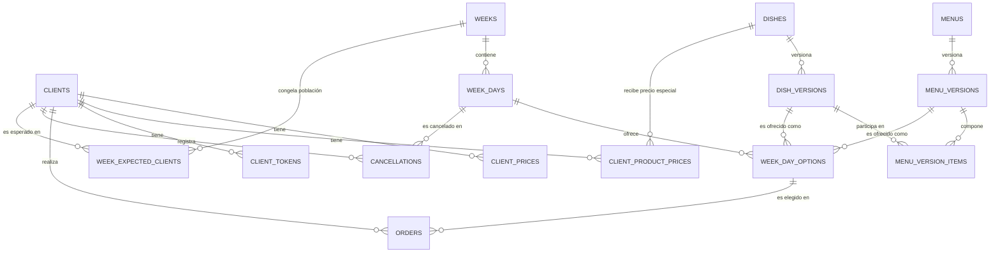

# Modelo de datos

Esquema PostgreSQL de Todo Artesanal.

- **15 tablas en `public`**: `clients`, `dishes`, `dish_versions`, `menus`,
  `menu_versions`, `menu_version_items`, `weeks`, `week_days`,
  `week_day_options`, `week_expected_clients`, `client_prices`,
  `client_product_prices`, `client_tokens`, `orders`, `cancellations`.
- **1 tabla en `private`**: `admin_users`.
- **Fuente de verdad**: `supabase/migrations/20260923000001_schema.sql`.

## Diagrama entidad-relación

**Cómo leer las cardinalidades:**

- `||--o{` = uno a muchos.
- `X ||--o{ Y` significa "un X puede tener cero o muchos Y, y cada Y
  pertenece a exactamente un X".

## Tablas de catálogo

### `dishes` (identidad lógica de platos)

| Columna | Tipo | Notas |
|---|---|---|
| `id` | uuid PK | |
| `category` | text null | Texto libre. Taxonomía no cerrada. |
| `climate` | text null | CHECK: `frio` / `templado` / `calor` / null. |
| `active` | boolean | Default `true`. Estado actual, no versionado. |
| `created_at` | timestamptz | |
| `updated_at` | timestamptz | |

**Por qué sin `name`:** el nombre vive en `dish_versions`. Cada edición del
nombre crea una versión nueva.

**Por qué `category` y `climate` acá y no en las versiones:** son atributos
de clasificación/consulta del plato, no parte del "contenido versionado".
Si se necesitara reconstruir la categoría histórica de un plato, habría que
versionarlos. Por ahora no se requiere.

### `dish_versions` (versiones inmutables de platos)

| Columna | Tipo | Notas |
|---|---|---|
| `id` | uuid PK | |
| `dish_id` | uuid FK → `dishes` | Sin cascade. |
| `version_number` | integer | > 0. |
| `name` | text | |
| `price` | numeric(10,2) | >= 0. |
| `created_at` | timestamptz | |

**UNIQUE `(dish_id, version_number)`.**

**Inmutabilidad:** trigger `dish_versions_immutable_update` y
`dish_versions_immutable_delete` rechazan cualquier UPDATE/DELETE.

### `menus` (identidad lógica de menús)

Igual estructura que `dishes` pero sin `category` ni `climate` (los menús
no tienen clima propio).

### `menu_versions`

Igual estructura que `dish_versions` pero sobre `menus`. Inmutable por
trigger.

### `menu_version_items` (composición de una versión de menú)

| Columna | Tipo | Notas |
|---|---|---|
| `id` | uuid PK | |
| `menu_version_id` | uuid FK → `menu_versions` | **ON DELETE CASCADE**. |
| `dish_version_id` | uuid FK → `dish_versions` | Sin cascade. |
| `role` | text | CHECK: `main` / `side`. |
| `created_at` | timestamptz | |

**UNIQUE `(menu_version_id, dish_version_id)`**: no se repite el mismo
plato dentro de un menú.

**Partial unique index** sobre `(menu_version_id) WHERE role='main'`:
máximo 1 main.

**Constraint trigger diferible** (`DEFERRABLE INITIALLY DEFERRED`):
garantiza ≥1 main al COMMIT de la transacción.

## Tablas de operación semanal

### `weeks`

| Columna | Tipo | Notas |
|---|---|---|
| `id` | uuid PK | |
| `start_date` | date | |
| `end_date` | date | |
| `status` | text | CHECK: `draft` / `active` / `closed`. |
| `created_at` | timestamptz | |
| `updated_at` | timestamptz | |

**EXCLUDE gist sobre `daterange(start_date, end_date, '[]')`:** no se
permiten semanas con rangos solapados.

**Partial unique index** sobre `(status) WHERE status='active'`: máximo
una semana activa a la vez.

**Trigger `weeks_status_protected`:** rechaza UPDATE de `status` fuera
de las funciones `activate_week` / `close_week`.

### `week_days`

| Columna | Tipo | Notas |
|---|---|---|
| `id` | uuid PK | |
| `week_id` | uuid FK → `weeks` | **ON DELETE CASCADE**. |
| `day_of_week` | smallint | CHECK: 1..5 (lunes a viernes). |
| `date` | date | Fecha concreta del día. |
| `created_at` | timestamptz | |

**CHECK `extract(isodow from date) = day_of_week`:** la fecha debe
corresponder al día de la semana.

**UNIQUE `(week_id, day_of_week)`** y **UNIQUE `(week_id, date)`**.

### `week_day_options` (opciones de oferta de un día)

| Columna | Tipo | Notas |
|---|---|---|
| `id` | uuid PK | |
| `week_day_id` | uuid FK → `week_days` | **ON DELETE CASCADE**. |
| `option_type` | text | CHECK: `dish` / `menu`. |
| `dish_version_id` | uuid FK → `dish_versions` | Nullable. |
| `menu_version_id` | uuid FK → `menu_versions` | Nullable. |
| `created_at` | timestamptz | |

**CHECK XOR:** `option_type='dish'` implica `dish_version_id NOT NULL` y
`menu_version_id NULL`; `option_type='menu'` al revés.

**Índices:** sobre `week_day_id`, `dish_version_id`, `menu_version_id`.

**Trigger `week_day_options_order_freeze`:** rechaza UPDATE/DELETE si la
opción ya tiene pedidos asociados.

### `week_expected_clients` (población congelada)

| Columna | Tipo | Notas |
|---|---|---|
| `week_id` | uuid FK → `weeks` | **ON DELETE CASCADE**. |
| `client_id` | uuid FK → `clients` | Sin cascade. |
| `created_at` | timestamptz | |

**PK compuesta** `(week_id, client_id)`.

**Índice** sobre `client_id`.

**Cómo se llena:** el RPC `activate_week` inserta los clientes con
`active = true` en el momento de la activación. No se actualiza después.

## Tablas de precios especiales

### `client_prices` (precios general y opcional del cliente)

| Columna | Tipo | Notas |
|---|---|---|
| `id` | uuid PK | |
| `client_id` | uuid FK → `clients` | **ON DELETE CASCADE**. |
| `modality` | text | CHECK: `general` / `opcional`. |
| `price` | numeric(10,2) | >= 0. |
| `created_at` | timestamptz | |
| `updated_at` | timestamptz | |

**UNIQUE `(client_id, modality)`.**

**Sin `media_vianda`:** la media vianda no tiene precio especial propio,
se calcula como 50% del precio normal.

### `client_product_prices` (precios especiales por plato)

| Columna | Tipo | Notas |
|---|---|---|
| `id` | uuid PK | |
| `client_id` | uuid FK → `clients` | **ON DELETE CASCADE**. |
| `dish_id` | uuid FK → `dishes` | **ON DELETE CASCADE**. |
| `price` | numeric(10,2) | >= 0. |
| `created_at` | timestamptz | |
| `updated_at` | timestamptz | |

**UNIQUE `(client_id, dish_id)`.**

**Referencia a `dishes.id`, no a `dish_versions.id`:** el precio especial
es una configuración actual del cliente, aplica a "Milanesa" como
concepto, no a una versión específica.

**Solo platos:** no existe precio especial por menú.

## Tablas de acceso

### `client_tokens`

| Columna | Tipo | Notas |
|---|---|---|
| `id` | uuid PK | |
| `client_id` | uuid FK → `clients` | **ON DELETE CASCADE**. |
| `token_hash` | text | SHA-256 en hex. Nunca plaintext. |
| `created_at` | timestamptz | |
| `invalidated_at` | timestamptz null | null = vigente. |
| `CHECK (invalidated_at is null or invalidated_at >= created_at)`. |

**UNIQUE `(token_hash)`.**

**Partial unique index** sobre `(client_id) WHERE invalidated_at IS NULL`:
máximo un token vigente por cliente.

**Cómo se llena:** la Edge Function `rotate-client-token`. El token
plaintext solo lo recibe el admin en la respuesta, y se descarta.

## Tablas operativas

### `orders` (pedidos)

| Columna | Tipo | Notas |
|---|---|---|
| `id` | uuid PK | |
| `client_id` | uuid FK → `clients` | Sin cascade. |
| `week_day_option_id` | uuid FK → `week_day_options` | Sin cascade. |
| `modality` | text | CHECK: `general` / `opcional` / `media_vianda`. |
| `quantity` | integer | Default 1. CHECK > 0. |
| `applied_price` | numeric(10,2) | CHECK >= 0. |
| `notes` | text null | Nota específica del pedido. |
| `created_at` | timestamptz | |
| `updated_at` | timestamptz | |

**UNIQUE `(client_id, week_day_option_id, modality)`.**

**Sin `on delete cascade` sobre `client_id` ni `week_day_option_id`:**
preserva historial. Borrar un cliente con pedidos falla con FK violation.

**`applied_price`:** unitario. El `total` se computa como
`quantity × applied_price`.

**Triggers:**

- `orders_validate_insert_update`: valida semana activa + cliente
  esperado + INSERT congela `applied_price` + UPDATE rechaza cambios
  de campos inmutables.
- `orders_closed_protection`: rechaza mutaciones si la semana está `closed`.
- `orders_no_cancellation`: rechaza el INSERT si hay cancelación del
  mismo cliente y día.

### `cancellations`

| Columna | Tipo | Notas |
|---|---|---|
| `id` | uuid PK | |
| `client_id` | uuid FK → `clients` | Sin cascade. |
| `week_day_id` | uuid FK → `week_days` | Sin cascade. |
| `created_at` | timestamptz | |
| `updated_at` | timestamptz | |

**UNIQUE `(client_id, week_day_id)`:** una cancelación por cliente/día.

**Sin `modality`:** la cancelación afecta al día completo.

**Triggers:**

- `cancellations_no_order`: rechaza el INSERT si hay pedido del mismo
  cliente y día.
- `cancellations_closed_protection`: rechaza mutaciones si la semana
  está `closed`.

## Tabla de seguridad

### `private.admin_users`

| Columna | Tipo | Notas |
|---|---|---|
| `user_id` | uuid PK | FK → `auth.users(id) ON DELETE CASCADE`. |

**Cómo se llena:** INSERT manual (ver `04_admin_setup.sql`). No tiene
UI de gestión.

**RLS:** habilitado sin policies. Solo accesible vía
`private.is_admin()` (security definer) o `public.is_user_admin()`
(security definer, RPC público).

## Índices por tabla

Además de los PK, UNIQUE y partial indexes:

| Tabla | Índice |
|---|---|
| `dish_versions` | `(dish_id)` |
| `menu_versions` | `(menu_id)` |
| `menu_version_items` | `(menu_version_id)` |
| `week_expected_clients` | `(client_id)` |
| `client_tokens` | `(client_id)` |
| `week_day_options` | `(week_day_id)` |
| `week_day_options` | `(dish_version_id)` |
| `week_day_options` | `(menu_version_id)` |
| `orders` | `(client_id)` |
| `orders` | `(week_day_option_id)` |
| `cancellations` | `(client_id)` |
| `cancellations` | `(week_day_id)` |

El índice `(week_id)` en `week_days` está cubierto por el UNIQUE
`(week_id, day_of_week)`.

## Notas de diseño

### Por qué tantos `ON DELETE CASCADE` hacia `weeks` y `week_days`

`week_days` cascadea a `week_day_options`, y esas cascadean (en la
práctica) a nada porque `week_day_options` no cascadea a `orders`. Pero
borrar una `week` sí arrastra los `week_days` y las `week_day_options`.
Las `orders` y `cancellations` **no** se borran.

Esto es intencional: si bien borrar una semana `draft` con opciones es
legítimo (nunca tuvo pedidos), borrar una `active` o `closed` no debería
poder hacerse desde el frontend.

### Por qué `orders.applied_price` es `numeric`, no `integer`

Los precios pueden tener centavos. `numeric(10,2)` acepta hasta 99 999 999.99.
`integer` limitaría a valores enteros.

### Por qué las cancelaciones no cascadean

`cancellations.client_id` y `cancellations.week_day_id` no tienen cascade.
Igual que `orders`. El historial se preserva.

### Referencias vs snapshots

| Dato | Cómo |
|---|---|
| Contenido de un plato en una versión | Referencia inmutable. |
| Precio aplicado a un pedido | Snapshot (`applied_price`). |
| Población esperada de una semana | Snapshot (`week_expected_clients`). |
| Estado del cliente al activar una semana | Implícito en `week_expected_clients`. |

## Migraciones

| Archivo | Contenido |
|---|---|
| `20260923000001_schema.sql` | DDL completo (15 tablas + `private.admin_users`) |
| `20260923000002_functions.sql` | `calculate_order_price`, `activate_week`, `close_week` |
| `20260923000003_triggers.sql` | Inmutabilidad, validaciones, protección de semanas `closed` |
| `20260923000004_rls.sql` | RLS, policies, grants |
| `20260923000005_admin_setup.sql` | INSERT del primer admin (comentado) |
| `20260924000001_menu_rpc.sql` | `create_menu`, `create_menu_version` |
| `20260924000002_week_rpc.sql` | `create_week`, `update_week` |
| `20260924000003_edge_function_grants.sql` | Grants de `service_role` sobre `private` |
| `20260924000004_admin_check_rpc.sql` | `is_user_admin` (RPC público) |